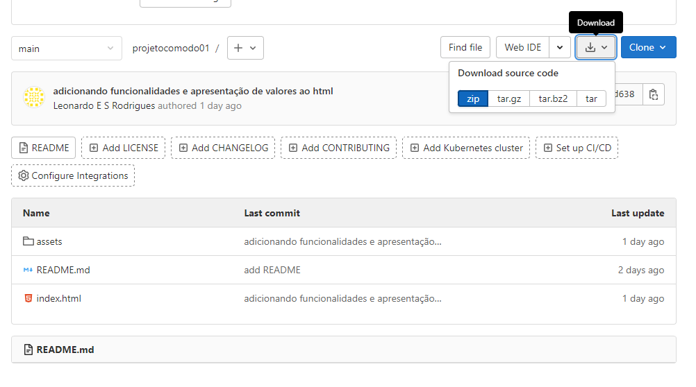
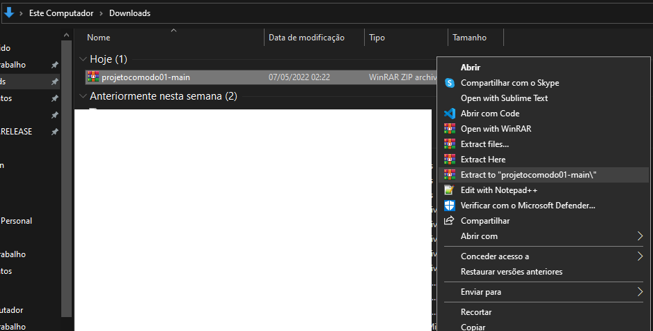
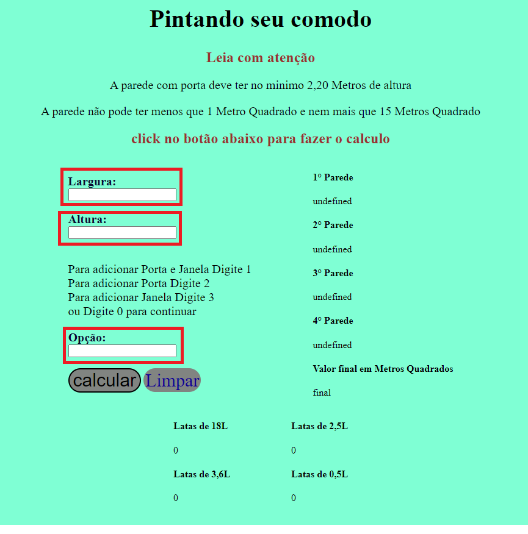
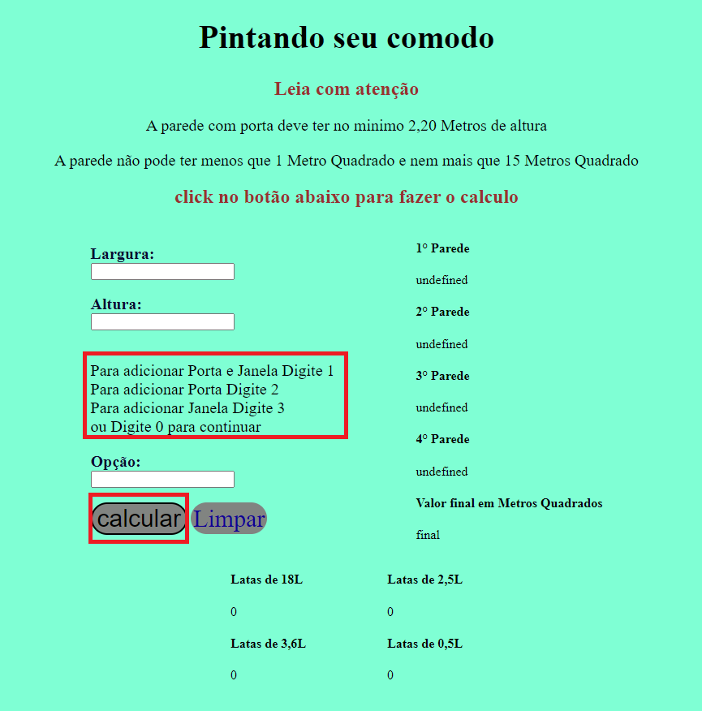
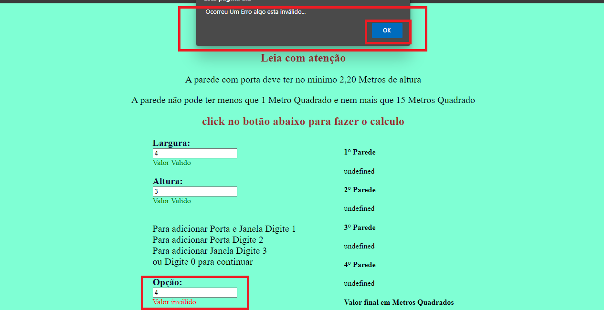
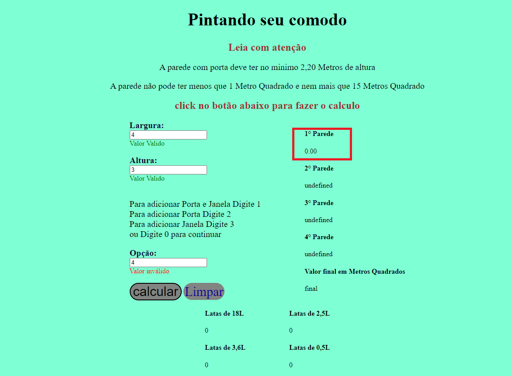
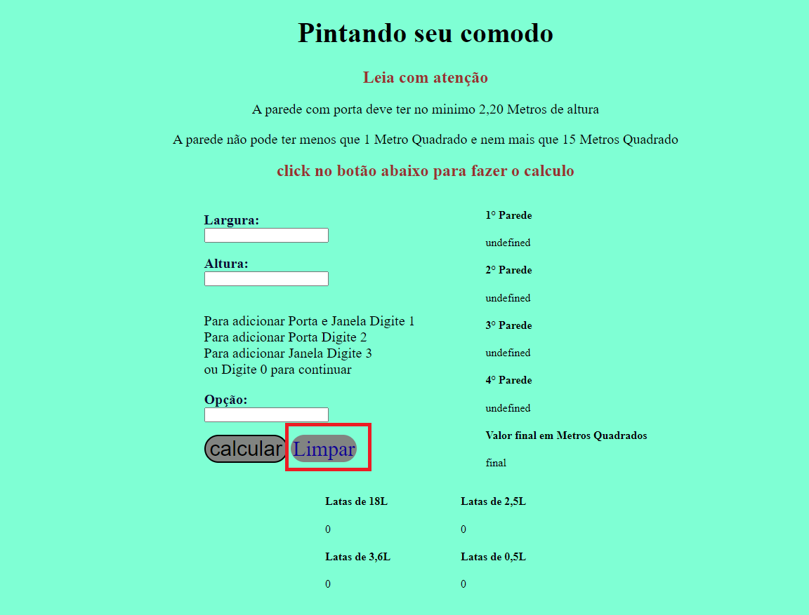
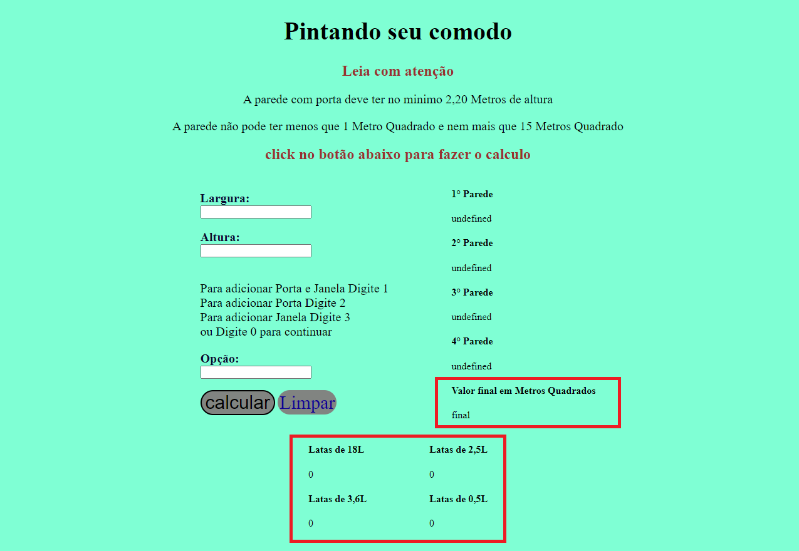

<h1 align="center" style="color: blue" > Projeto Comodo </h1>

<h2 align="center" style="color: #00BFFF " > ...passo a passo de como usar a aplicação... </h2>

# Instalando
<h3> Para acessar a aplicação click no link a baixo </h3>

<h3 style="color: #C0C0C0 " > 1° acesse esse link a baixo</h3>
 <a> https://gitlab.com/Leonardo0908/projetocomodo01 </a> 
 
 click em Download e depois baixe o arquivo em zip 

   

<h3 style="color: #C0C0C0 " > 2° extrair zip </h3>

   

<h3 style="color: #C0C0C0 " > 3° Entre na pasta já estraida e acesse o aquivo index </h3>  

 Após abrir o index é só usar a aplicação 

   

# Como Funciona

<h3 style="color: #C0C0C0 " > 1° Preencha os campos </h3>

   

<h3 style="color: #C0C0C0 " > 2°  Leia e aperte o botão calcular  </h3>

   

<h3 style="color: #C0C0C0 " > 3° Podem ocorrer erros  </h3>

 Fique tranquilo sempre que ouver um erro ele emitira um alerta explicando o possivel erro 

 Click em OK e tente novamente, não esqueca de ler os alertas 

   

<h3 style="color: #C0C0C0 " > 4° Os Erros acrecentaram o valor 0 a parede </h3>

 Fique tranquilo sempre que ouver um erro você pode tentar novamente sem perder o que já foi feito 

   

<h3 style="color: #C0C0C0 " > 5° Limpando Campos </h3>

 Se você digitou algo errado e quer começar novamente basta apertar o botão limpar 

 Se quiser fazer uma nova conta aperte o botão limpar 

   

<h3 style="color: #C0C0C0 " > 6° Resultados </h3>

 Destacados em vermelho os campos que seram apresentados os resultados do valor final 

 A cada cálculo o valor é atualizado assim o você pode ver cada passo 

   

# Link da Aplicação na Nuvem

## ⚠️ !!EM Desenvolvimento!! ⚠️ 
